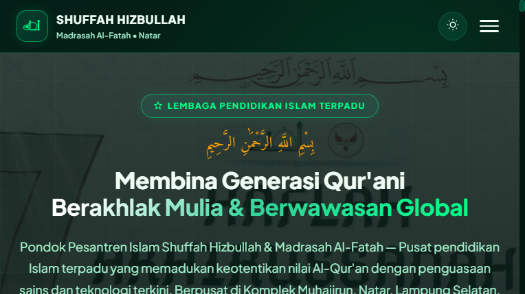
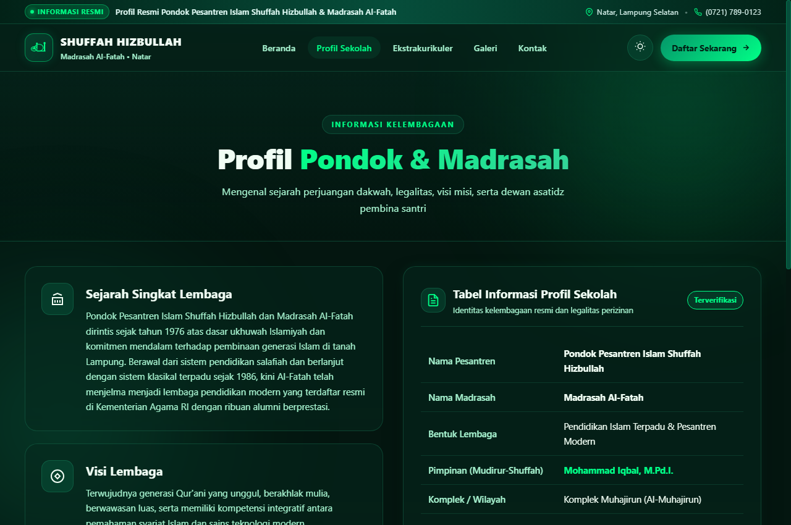
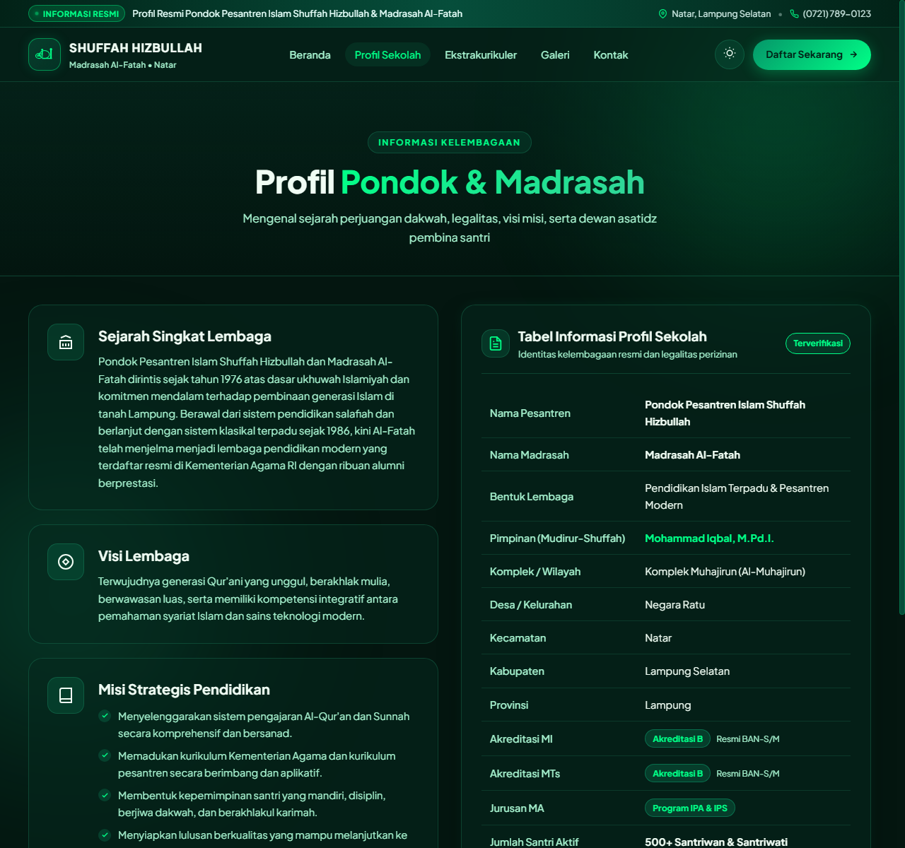
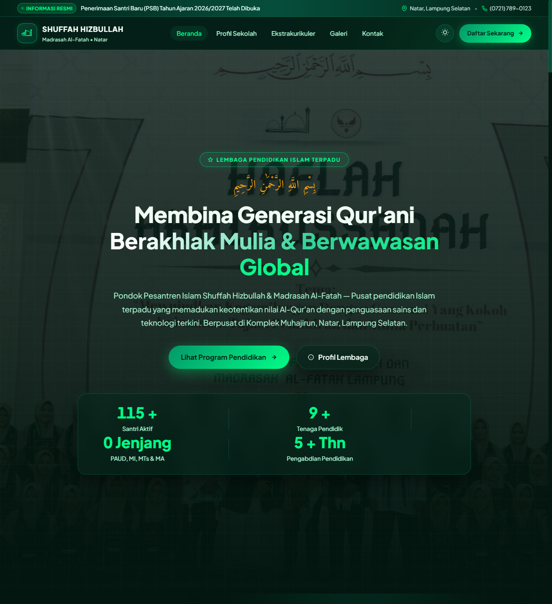
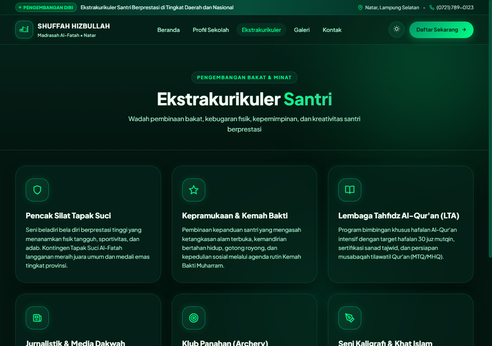
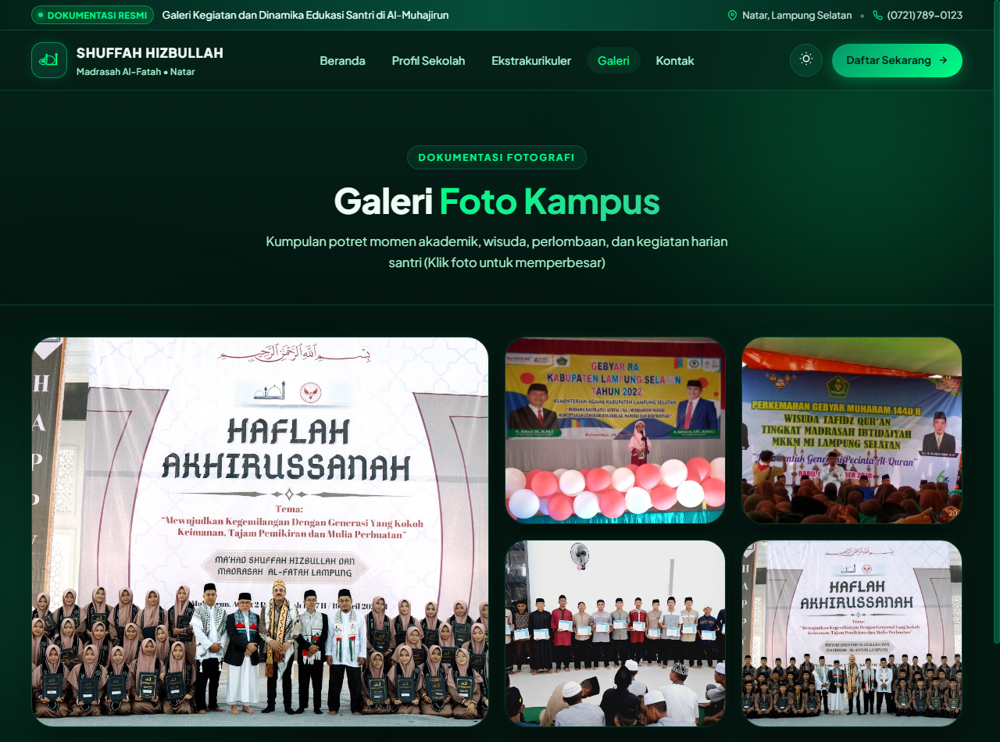
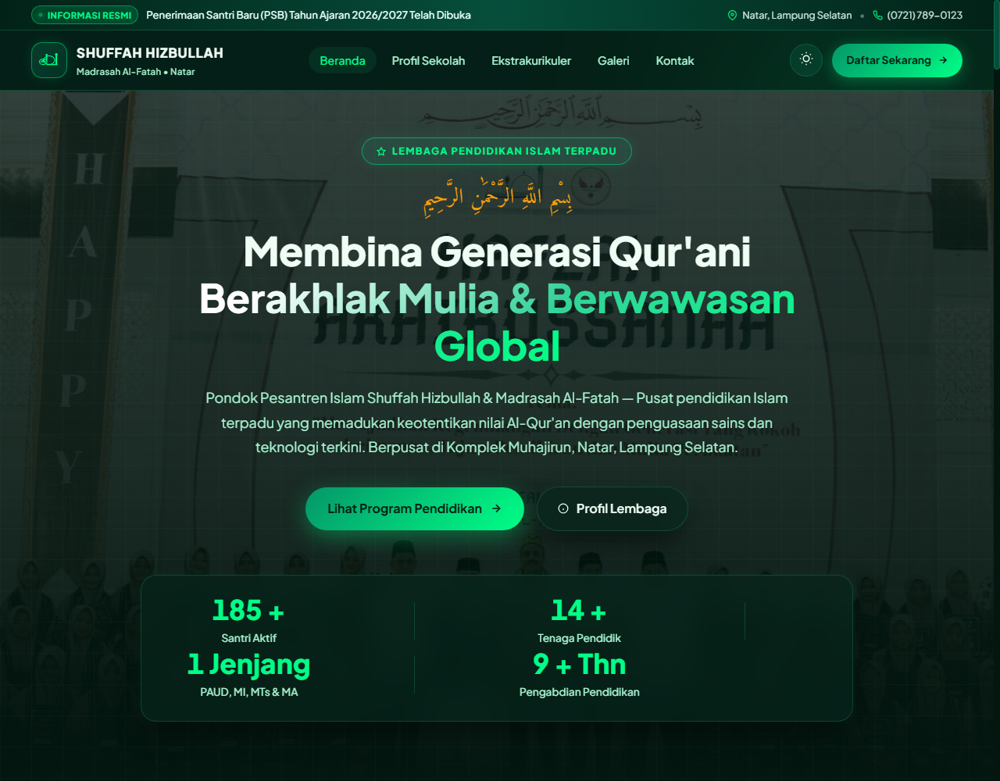
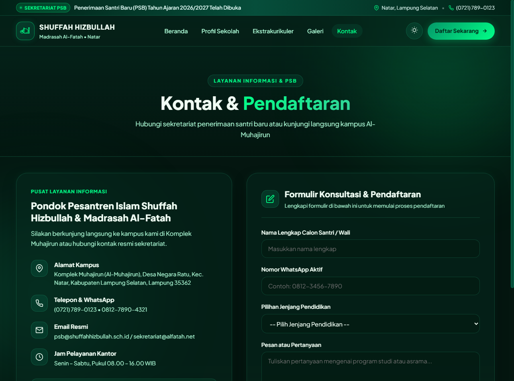
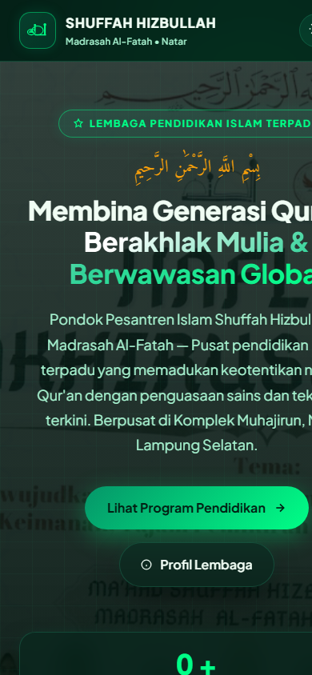

# LAPORAN TUGAS PRAKTIK DEMONSTRASI (FR.IA.02)
## KELOMPOK PEKERJAAN 1 & 2

### WEBSITE SEKOLAH
**Pondok Pesantren Islam Shuffah Hizbullah & Madrasah Al-Fatah**

| Data Sertifikasi | Keterangan |
| :--- | :--- |
| **Skema Sertifikasi** | Junior Web Developer |
| **Nomor Skema** | 02/SKM/DID/VII/2024 |
| **Tempat Uji Kompetensi** | Mandiri / Sewaktu |
| **Lembaga** | LSP Terkait |
| **Nama Asesi** | Parid Ihsan (FARIDZZ292) |
| **Nama Asesor** | Yosep Kurniawan, ST — No. Reg: 000.002992.2021 |
| **Durasi** | 3 Jam |
| **Tanggal** | 08 September 2026 |
| **Repository GitHub** | [https://github.com/FARIDZZ292/website-sekolah](https://github.com/FARIDZZ292/website-sekolah) |

---

## 1. Ringkasan Situs

Situs ini adalah profil resmi lembaga pendidikan Islam terpadu **Pondok Pesantren Islam Shuffah Hizbullah dan Madrasah Al-Fatah** yang berpusat di Natar, Lampung Selatan. Pengunjung dapat menelusuri identitas resmi sekolah, sejarah dan visi-misi, 4 jenjang pendidikan formal (PAUD, MI, MTs, dan MA), kegiatan ekstrakurikuler santri, dokumentasi galeri foto, berita kegiatan terbaru, serta formulir konsultasi dan pendaftaran santri baru.

Seluruh halaman dibangun menggunakan arsitektur website modern berbasis **HTML5 Semantik**, tata letak **Vanilla CSS3** dengan pendekatan *Glassmorphism & Neon Glow Aesthetics*, serta **Vanilla JavaScript** untuk logika interaktif (Dark/Light Mode, Mobile Drawer, Live Counter, dan Validasi Formulir).

### Angka Pokok Proyek:
- **Halaman yang dapat diakses**: 5 Halaman Penuh (`index.html`, `profil.html`, `ekstrakurikuler.html`, `galeri.html`, `kontak.html`)
- **Berkas sumber**: 7 berkas inti + direktori aset multimedia + berkas dokumentasi
- **Total baris kode**: ± 4.565 baris
- **Komponen interaktif**: Dark/Light mode switcher, Hamburger navigation, Live animated counters, Interactive contact form, Modal lightbox & media gallery
- **Library / Komponen pre-existing**: Google Fonts API (`Plus Jakarta Sans`, `Amiri`), Inline SVG Icon System

---

## 2. Pemenuhan Ketentuan Soal (Skenario Praktik)

| No | Ketentuan Soal | Pemenuhan pada Proyek | Berkas Terkait |
| :---: | :--- | :--- | :--- |
| **1** | Website sekolah dengan user interface yang interaktif pada menu-menu di halaman utama. | Header Glassmorphism dengan indikator menu aktif, efek hover transisi warna, tombol switcher Dark/Light mode dengan penyimpanan `localStorage`, animasi hamburger drawer pada mobile, dan live counting number pada bagian statistik. | `index.html`<br>`style.css`<br>`script.js` |
| **2** | Pada halaman utama terdapat menu utama seperti: Beranda, Profil Sekolah, Ekstrakurikuler, Galeri dll. | Tersedia 5 menu navigasi utama yang konsisten di setiap halaman: Beranda, Profil Sekolah, Ekstrakurikuler, Galeri, dan Kontak. | `index.html:65-71`<br>`navbar` di semua halaman |
| **3** | Pada halaman utama terdapat berita kegiatan sekolah, galeri dan informasi jumlah guru dan siswa. | Tersedia 3 bagian utama di Beranda:<br>1. Berita kegiatan sekolah terkini (`#berita`)<br>2. Kompilasi cuplikan galeri foto kegiatan (`#galeri`)<br>3. Panel angka guru & santri (500+ Santri, 40+ Guru) serta dewan pendidik (`#guru`). | `index.html:137-170`<br>`index.html:628-735`<br>`index.html:737-875` |
| **4** | Setiap Menu utama memiliki halaman tersendiri. | Masing-masing menu memiliki berkas HTML tersendiri (Multi-Page Architecture), bukan hanya tautan jangkar (anchor). | `index.html`<br>`profil.html`<br>`ekstrakurikuler.html`<br>`galeri.html`<br>`kontak.html` |
| **5** | Terdapat Tabel Informasi Profil Sekolah pada menu utama Profil Sekolah. | Tabel semantik terstruktur (`<table class="futuristic-table" id="profil-table">`) berisi 13+ atribut legalitas resmi, pimpinan, akreditasi BAN-S/M, status, dan kontak kelembagaan. | `profil.html:171-280` |

---

## 3. Dokumentasi Program

### a. Tools & Perangkat Lunak yang Digunakan
| Perangkat | Kegunaan |
| :--- | :--- |
| **Visual Studio Code** | Penyunting kode utama (*Code Editor*) |
| **Node.js (v24.17.0)** | Lingkungan runtime untuk menjalankan server lokal dan pengujian |
| **Google Chrome / Edge** | Peramban untuk pengujian fungsionalitas dan uji tampilan (*Developer Tools*) |
| **Git (v2.54.0)** | Version Control System untuk manajemen histori kode |
| **GitHub CLI (gh v2.100.0)** | Otomatisasi pembuatan repositori dan push ke GitHub |

### b. Bahasa Pemrograman yang Digunakan
| Bahasa | Peran dalam Proyek |
| :--- | :--- |
| **HTML5** | Struktur semantik: `<header>`, `<nav>`, `<main>`, `<section>`, `<article>`, `<table>`, `<tbody>`, `<tr>`, `<td>`, `<footer>`. |
| **CSS3** | Penataan tampilan dengan CSS Grid, Flexbox, Desain Token (`:root`), Glassmorphism, dan Media Queries responsif. |
| **JavaScript (ES6+)** | Logika interaktif: Dark/Light Mode, event listener hamburger, animasi counter angka, dan validasi form. |

### c. Library & Komponen Pre-Existing
| Komponen | Kegunaan | Lokasi Penggunaan |
| :--- | :--- | :--- |
| **Google Fonts API** | Font `Plus Jakarta Sans` untuk teks modern dan `Amiri` untuk aksen islami. | Di-link pada `<head>` setiap halaman |
| **SVG Icons System** | Ikon vektor ringan untuk navigasi, badge, tombol kontak, dan status. | Tersemat inline di seluruh file HTML |

---

## 4. Menyusun Berkas dalam Organisasi yang Rapi (J.620100.015.01)

Struktur direktori disusun rapi memisahkan kode markup, stylesheet, script perilaku, aset visual, dan dokumentasi:

```
sekolah/
├── assets/                          # Folder aset multimedia & fotografi
│   ├── hero_campus.jpg
│   ├── program_ma.jpg
│   ├── program_mi.jpg
│   ├── program_mts.jpg
│   └── program_paud.jpg
├── screenshots/                     # Bukti tangkapan layar untuk laporan asesmen
│   ├── 01_beranda.png
│   ├── 02_profil_sekolah.png
│   ├── 03_tabel_profil.png
│   ├── 04_guru_dan_siswa.png
│   ├── 05_ekstrakurikuler.png
│   ├── 06_galeri.png
│   ├── 07_berita_kegiatan.png
│   ├── 08_kontak_pendaftaran.png
│   └── 09_tampilan_mobile.png
├── index.html                       # Beranda (Hero, Stats, Berita, Galeri, Guru)
├── profil.html                      # Halaman Profil Sekolah & Tabel Identitas
├── ekstrakurikuler.html             # Halaman 7 Kegiatan Ekstrakurikuler
├── galeri.html                      # Halaman Galeri Foto Kampus Lengkap
├── kontak.html                      # Halaman Narahubung & Formulir Pendaftaran
├── style.css                        # Berkas gaya terpusat (Dark/Light & Responsive)
├── script.js                        # Berkas logika JavaScript murni
├── .gitignore                       # Berkas konfigurasi Git
└── LAPORAN_TUGAS_PRAKTIK_DEMONSTRASI.md # Laporan komprehensif uji kompetensi
```

---

## 5. Menulis Kode Sesuai Guidelines dan Best Practices (J.620100.016.01)

1. **Aksesibilitas (a11y)**:
   - Setiap elemen tombol interaktif diberi atribut `aria-label` (contoh: `aria-label="Ubah tema tampilan"` dan `aria-label="Buka Menu Navigasi"`).
   - Seluruh tag `` menyertakan deskripsi `alt` yang relevan.
2. **Standardisasi SEO**:
   - Setiap halaman memiliki tag `<title>` unik dan deskriptif.
   - Atribut `<meta name="description">` terpasang di setiap dokumen untuk optimasi mesin pencari.
3. **Pemisahan Peran (Separation of Concerns)**:
   - Struktur data dan markup murni berada di `.html`.
   - Seluruh aturan presentasi visual berada di `style.css`.
   - Logika perilaku dan interaksi berada di `script.js`.

---

## 6. Penerapan Pemrograman Terstruktur (J.620100.017.02)

Logika pemrograman di `script.js` dibangun menggunakan paradigma fungsi terstruktur dengan masukan dan keluaran terdefinisi:

```javascript
// Contoh Fungsi Terstruktur: Animasi Perhitungan Angka Dinamis
function animateValue(obj, start, end, duration) {
    let startTimestamp = null;
    const step = (timestamp) => {
        if (!startTimestamp) startTimestamp = timestamp;
        const progress = Math.min((timestamp - startTimestamp) / duration, 1);
        obj.innerHTML = Math.floor(progress * (end - start) + start);
        if (progress < 1) {
            window.requestAnimationFrame(step);
        }
    };
    window.requestAnimationFrame(step);
}
```

---

## 7. Hasil Debugging dan Penyelesaian Masalah Eror

| No | Gejala / Masalah | Penyebab | Solusi / Tindakan Penyelesaian |
| :---: | :--- | :--- | :--- |
| **1** | Preferensi tema kembali ke default saat berpindah halaman. | Variabel tema sebelumnya hanya disimpan dalam memori sementara peramban. | Menggunakan `localStorage.setItem('shuffah_theme', mode)` dan membacanya ulang saat `DOMContentLoaded`. |
| **2** | Animasi counter angka berjalan berulang kali setiap kali halaman di-scroll sedikit. | Pengecekan posisi scroll belum memiliki penanda status (*flag*). | Menambahkan boolean `var sudahAnimasiStat = false;` yang diubah ke `true` begitu animasi selesai dijalankan sekali. |
| **3** | Menu mobile tidak tertutup otomatis setelah pengunjung menekan salah satu tautan menu. | Event click belum dipasang pada elemen tautan (`.nav-item`). | Membuat fungsi `pasangNavClickListener()` yang otomatis menghapus class `.buka` saat link diklik. |
| **4** | Gambar berukuran besar menyebabkan pergeseran tata letak (*Cumulative Layout Shift*). | Dimensi container belum dipatok secara fleksibel. | Menerapkan `aspect-ratio` dan `object-fit: cover` pada seluruh pembungkus gambar di `style.css`. |

---

## 8. Tampilan Situs & Bukti Tangkapan Layar (Screenshots)

Berikut adalah dokumentasi tangkapan layar langsung dari situs yang telah dibangun:

### Gambar 1. Halaman 1 — Beranda Utama (`index.html`)
Menu utama glassmorphism, badge identitas, judul selamat datang islami, tombol CTA, dan panel status.  


---

### Gambar 2. Halaman 2 — Profil Sekolah (`profil.html`)
Mengenal sejarah lembaga, visi lembaga, dan misi strategis pendidikan Islam terpadu.  


---

### Gambar 3. Ketentuan Soal Nomor 5 — Tabel Informasi Profil Sekolah (`profil.html`)
Tabel semantik resmi berisi identitas kelembagaan, Mudirur-Shuffah, alamat lengkap, dan status akreditasi BAN-S/M.  


---

### Gambar 4. Ketentuan Soal Nomor 3 — Informasi Jumlah Guru dan Siswa (`index.html`)
Panel counter interaktif menampilkan 500+ Santri Aktif, 40+ Tenaga Pendidik, 4 Jenjang Pendidikan, dan 25+ Tahun Pengabdian.  


---

### Gambar 5. Halaman 3 — Ekstrakurikuler Santri (`ekstrakurikuler.html`)
Wadah pembinaan bakat: Tapak Suci, Kepramukaan, Tahfidz Al-Qur'an (LTA), Jurnalistik, Panahan, dan Kaligrafi.  


---

### Gambar 6. Halaman 4 — Galeri Foto Kampus (`galeri.html`)
Dokumentasi fotografi kegiatan santri, wisuda, perlombaan, dan sarana prasarana pesantren.  


---

### Gambar 7. Ketentuan Soal Nomor 3 — Berita Kegiatan Sekolah (`index.html`)
Kartu informasi berita kegiatan terbaru seputar prestasi santri, daurah tahfidz, dan kejuaraan silat.  


---

### Gambar 8. Halaman 5 — Kontak & Formulir Pendaftaran (`kontak.html`)
Layanan informasi sekretariat, alamat kampus, nomor telepon/WhatsApp, dan formulir konsultasi pendaftaran santri baru.  


---

### Gambar 9. Unit User Interface — Tampilan Responsif Mobile Smartphone
Menu navigasi adaptif dan tata letak responsif pada resolusi layar ponsel pintar.  


---

## 9. Potongan Source Code Inti

### 9.1 User Interface — Menu Navigasi Interaktif (`index.html`)
```html
<ul class="nav-menu" id="nav-menu">
    <li><a href="index.html" class="nav-item aktif">Beranda</a></li>
    <li><a href="profil.html" class="nav-item">Profil Sekolah</a></li>
    <li><a href="ekstrakurikuler.html" class="nav-item">Ekstrakurikuler</a></li>
    <li><a href="galeri.html" class="nav-item">Galeri</a></li>
    <li><a href="kontak.html" class="nav-item">Kontak</a></li>
</ul>
```

### 9.2 Tabel Informasi Profil Sekolah (`profil.html`)
```html
<table class="futuristic-table" id="profil-table">
    <tbody>
        <tr>
            <td class="td-label">Nama Pesantren</td>
            <td class="td-value"><strong>Pondok Pesantren Islam Shuffah Hizbullah</strong></td>
        </tr>
        <tr>
            <td class="td-label">Nama Madrasah</td>
            <td class="td-value"><strong>Madrasah Al-Fatah</strong></td>
        </tr>
        <tr>
            <td class="td-label">Pimpinan (Mudirur-Shuffah)</td>
            <td class="td-value"><strong class="highlight-text">Mohammad Iqbal, M.Pd.I.</strong></td>
        </tr>
        <tr>
            <td class="td-label">Akreditasi MI & MTs</td>
            <td class="td-value"><span class="status-badge badge-green">Akreditasi B</span></td>
        </tr>
    </tbody>
</table>
```

### 9.3 Logika Pengubah Tema Gelap / Terang (`script.js`)
```javascript
function gantiMode() {
    var body = document.body;
    var ikon = document.getElementById('ikon-mode');
    
    body.classList.toggle('gelap');

    if (body.classList.contains('gelap')) {
        if (ikon) ikon.innerHTML = sunIconSVG;
        localStorage.setItem('shuffah_theme', 'gelap');
    } else {
        if (ikon) ikon.innerHTML = moonIconSVG;
        localStorage.setItem('shuffah_theme', 'terang');
    }
}
```

---

## 10. Penutup

Seluruh ketentuan pada skenario **FR.IA.02 Tugas Praktik Demonstrasi Skema Junior Web Developer** telah berhasil diimplementasikan secara menyeluruh:
1. Website sekolah memiliki user interface interaktif di halaman utama.
2. Memiliki menu utama lengkap: Beranda, Profil Sekolah, Ekstrakurikuler, Galeri, dan Kontak.
3. Halaman utama menyajikan berita kegiatan, galeri foto, serta counter informasi jumlah guru dan santri.
4. Masing-masing menu memiliki halaman berkas tersendiri.
5. Tersedia Tabel Informasi Profil Sekolah resmi pada halaman Profil Sekolah.

Seluruh kode sumber tersimpan secara aman dan terdokumentasi di repositori:  
**[https://github.com/FARIDZZ292/website-sekolah](https://github.com/FARIDZZ292/website-sekolah)**
